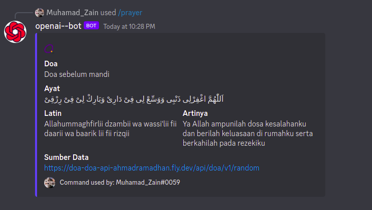

### Discord Bot

> (Open Source Project) Simple discord bot application integrated with open ai, Quran, and Prayer Schedule

---

## Table of contents

- [Table of contents](#table-of-contents)
- [Prerequiste](#prerequiste)
- [Depedencies](#depedencies)
- [Resources](#resources)
- [Installation and Cofiguration](#installation)
- [Screen Capture](#capture)

## Prerequiste

- [node js](https://nodejs.org/en/) - Download and Install Composer

## Depedencies

- dotenv
- date-fns
- discord.js
- openai
- libsodium-wrappers
- ffmpeg-static

## Resources

- [Jadwal Sholat / Prayer Schedule](https://github.com/lakuapik/jadwalsholatorg)
- [surah](https://github.com/rioastamal/quran-json)
- [Open AI](https://beta.openai.com/docs/introduction)
- [Murotal API](https://api.quran.gading.dev/)
- [Random Prayer](https://doa-doa-api-ahmadramadhan.fly.dev/api/doa/v1/random)

## Installation

1. Clone repository

```bash
$ git clone https://github.com/Zainal21/discord-bot.git
```

2. move to directory project and Install depedencies

```bash

$ cd discord-bot

$ yarn install or npm install
```

3. Setup your environment variable in `.env` files or rename `.env.example to .env`.

4. run script

```bash
$  node deploy-command.js // for initialize discord command handler
$  node app.js
```

5. if your running inside container, you can pull the official image

```bash
$ docker pull registry.gitlab.com/zainal21/discord-bot
$ docker run -it registry.gitlab.com/zainal21/discord-bot:latest
```

6. if your running inside container using docker compose plugin, you can run command :

```bash
$ docker compose up -d
```

## Screen Capture




---

Copyright © 2023 by Muhamad Zainal Arifin
